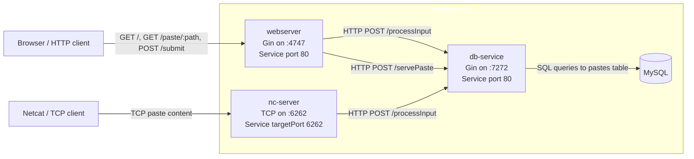

# Elan Thomas England

Welcome to my site! This is a simple portfolio site which discusses some projects that I've built.

Scroll down to read an introduction to each project, and click the heading to see the full write-up.




Shellbin is a microservice architecture project that I built to exercise my understanding of CI/CD for cloud-native applications.

It's named shellbin because it's a pastebin clone that you can access with your shell using Unix pipes and the `netcat` utility.

```fish
cat $FILE | nc <address> <port>
```

Users can also create pastes using a web front-end written in Go that uses server-side rendering.



In total, there are 4 discrete container images involved in this project: A web server, a database service, a netcat-receiving-server, and the MySQL database container.

As mentioned, the main goal of this project was to experiment with a development pipeline for these microservices.

The CI/CD pipeline ends up being pretty simple:

- First, shellbin's Kubernetes manifests are sourced from a Helm chart that is tracked by ArgoCD
  - ArgoCD makes sure that the most recent versions of the application manifests are deployed
- When we push to the shellbin repo, our GitHub Actions workflow goes something like this:
  - builds the container images, then pushes them to GitHub Container Registry (GHCR)
  - clones the Kubernetes cluster's declarative GitOps repository
  - modifies the image tags in the Helm Chart's values.yml so they point to the newly pushed images
  - commits and pushes the diff that has the new image tags to cluster's configuration repo
- And then ArgoCD picks up changes and the cluster deploys updates to the container images and Helm Chart

Read the [full Shellbin write-up here](/shellbin/) for more details.

<hr>
    



<br>
    


<br>

Webterm is a system that allows users to access Unix machines from their web browser.

Here are some of the moving-pieces involved with this project:
- Website frontend that visually emulates a terminal in the browser
- Client-side JavaScript that requests a terminal assignment from the backend
- Client-side JavaScript that connects the browser to the selected terminal pod
- Go service that tracks which terminal pods are free, in use, or being recreated
- Go service that creates new capacity when the spare terminal pool runs out
- Container image that runs the Linux shell environment exposed to users through node-pty

The most notable aspect is the project's terminal manager written in Go, `pseudo-terminal-manager`, which allocates and exposes backend terminal instances programmatically via the Kubernetes API.

Read the [full Webterm write-up here](/webterm/) for more details.
