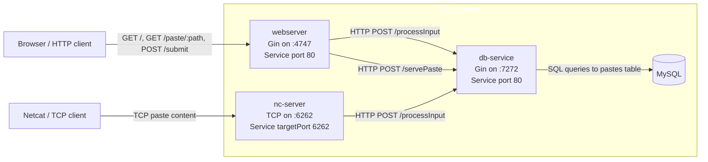

# Elan Thomas England

This is a portfolio website that discusses some projects I've built.

Scroll down to read an introduction to each project, and click the heading to see the full write-up.

<br>
    
## [Shellbin](/shellbin/)
<hr>

Shellbin is a microservice architecture project that I built to exercise my understanding of CI/CD for cloud-native applications.

It's named shellbin because it's a pastebin clone that you can access with your shell using Unix pipes and the `netcat` utility.

```fish
cat $FILE | nc sb.cat-z.xyz
```

Users can also create pastes using a web front-end written in Go that uses server-side rendering.

The CLI and the web front-end both talk with the same decoupled microservice which itself talks to the database. 
This relationship is expressed in the diagram below.



In total, there are 4 discrete container images involved in this project: A web server, a database service, a netcat-receiving-server, and the MySQL database container.

As mentioned, the main goal of this project was to experiment with a developement pipeline for these microservices.

The CI/CD pipeline ends up being pretty simple:


- Firstly, the shellbin's Kubernetes deployment relies on a Helm chart that is tracked by the cluster's git repository
- Then in the shellbin repository, when we push to GitHub, our workflow:
  - builds the container images, then pushes them to GitHub Container Registry (GHCR)
  - clones the Kubernetes cluster's declarative git repository
  - modifies the image tags in the Helm values chart to point to the newly pushed images
  - commits and pushes the diff that has the new image tags
- And then ArgoCD picks up changes and the cluster reconciles with the new images

Read the [full Shellbin write-up here](/shellbin/) for more details.

<br>
    
## [Webterm](/webterm/)
---

Webterm is a system that allows users to access Unix machines from their web browser.

I wrote this project because I wanted to do something in Kubernetes that sounded really interesting and a bit intimidating. Basically, my goal was to write Go code to interact with the Kubernetes API to create, destroy, and scale pods based on user load, and assign each pod to a user.

This project was out of my comfort zone and the source code reflects that. 
Despite that, it actually works!

Building something to process Kubernetes API data myself instead of using a pre-built solution taught me a bit about Kubernetes and Go.

It also allowed me to implement some very neat and famous concurrency patterns in golang.


The most interesting part is the following code, which is a essentially a concurrent process watcher that can respond to updates from the pod-scaling system. (TODO fix this explanation)

A commented version of this code is available in the project write-up.


```go
	for {
		select {
		case paramToAppend := <-fil.paramStream:
			fil.params = append(fil.params, &paramToAppend)
			fmt.Printf("params: %v\n", fil.params)
		case indexToRemove := <-fil.remIndexChan:
			fil.params = remove(fil.params, indexToRemove)
		case event := <-fil.inChan:
			for _, fp := range fil.params {
				if fp.pass(event, fil.done) {
					fp.outChan <- event
				}
			}
		case <-fil.done:
			return
		default:
			if len(fil.params) == 0 {
				close(fil.done)
				runningFilter = nil
			}
		}
	}
```

This concurrency pattern is called a "for select loop", which I read about in the very fun book [Concurrency in Go](https://katherine.cox-buday.com/concurrency-in-go/) by Katherine Cox-Buday.

There's a quite a bit involved in this project:
- Website frontend that emulates a terminal, and client-side JS to request a new Unix machine container from the Kubernetes cluster.
- Containers to run the Unix machine that is served to clients.
- Synchronization between pseudo-terminal hosting containers and website frontend
- Kubernetes cluster that orchestrates all containers
- TODO

Read the [full Webterm write-up here](/shellbin/) for more details.
