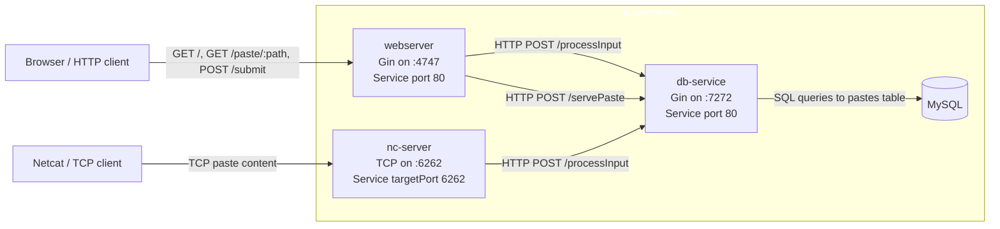

+++
title = "Shellbin Project Writeup: A Simple Microsevice Developement Pipeline"
date = 2026-03-04
slug = "shellbin"
+++

## Introduction

Shellbin is a microservice architecture project that I built to exercise my understanding of CI/CD for microservice applications.

It's named shellbin because it's a pastebin clone that you can access with your shell using Unix pipes and the `netcat` utility.

```fish
cat $FILE | nc <www.shellbin.address>
```

The product is intentionally simple. It's just a pastebin clone, so we can think about the DevOps aspects without worrying too much about the product implementation.

### Technical Overview
- Decoupled microservices, runs on Kubernetes
- There are four total container images involved in shellbin
- Three containers run custom binaries built with Go, and one container is stock mysql
- The deployment pipeline is based on ArgoCD, GitHub Actions, and GHCR

There are two repos involved in building and deploying shellbin:
1. `england2/shellbin`
    - Contains both application source code **and** templating/build files (Dockerfiles and Helm chart)
    - Builds and pushes the container images to GHCR via GitHub Actions
    - Defines how the application is deployed onto Kubernetes via Helm
    - Pipeline deployment step talks to the ArgoCD repository
2. `england2/cluster-repo`
    - Is the main GitOps repository for my local cluster
    - Holds general cluster configuration in addition to `shellbin` related configuration
    - Declares the desired state of the Kubernetes cluster, and state is enforced by ArgoCD
    - Exposes `shellbin` configuration plainly, allowing for a simpler multi-repo deployment pipeline

### Source code
The good stuff right up front.

Here's the [shellbin source code](https://www.github.com/england2/shellbin), and here's the [cluster-repo source code](https://www.github.com/england2/cluster-repo).

## Shellbin Project Structure



The project has 4 distinct services:
- `webserver`
  - provides web interface to create and view posts
  - communicates with `db-service` for database operations
- `nc-server`
  - provides netcat server to create pastes from the command line
  - communicates with `db-service` for database operations
- `db-service`
  - shared database layer provided to `webserver` and `nc-server`
- `mysql`
    - a stock mysql container as the database
    - manages data as a simple statefulSet with a persistentVolumeClaim

## How does the CI/CD work?

## ArgoCD

First, let's cover ArgoCD. ArgoCD is a declarative GitOps system for Kubernetes. This means that it uses a git repo as a _"source of truth"_, and reconciles the cluster state to match the yaml/state that's defined in the repo.

Here's a basic example:
- ArgoCD is configured to watch a certain folder named `test-dir` that exists in a git repo.
- In `test-dir`, I define a Kubernetes resource called `test-deployment.yml`.
- I commit and push this change to the git repo.
- ArgoCD detects this change and creates this resource automatically!

And here are some additional details that come into play with this project.
- ArgoCD can be configured to watch a folder in _any repository_, not just the main cluster configuration repo.
- ArgoCD can be configured to watch a folder representing a _full Helm chart_ (and deploy it as such), not just separate yaml files.
- ArgoCD can select a different Helm values.yml chart than what is shipped in the default Helm release.

This helps us define the `shellbin` deployment agnostically. Its deployment is not tied to ArgoCD, and anyone with Helm can deploy it.

ArgoCD allows for deployment of related Kubernetes resources using what it calls an "Application".
The following is a snippet of our ArgoCD Application definition along with relevant comments.

[application-shellbin.yml](https://github.com/england2/cluster-repo/blob/main/argocd-reconciled-yaml/cluster-yaml/applications-argocd-config/application-shellbin.yml)

```yaml
# ...
  sources:
    # Select the `shellbin` repo as a source.
    - repoURL: git@github.com:england2/shellbin.git
      # Deploy from the default branch (main).
      targetRevision: HEAD
      # `path: helm` refers to the `helm` folder in england2/shellbin, which is the 
      # folder where our shellbin Helm chart lives
      path: helm
      # Configuring this ArgoCD Application to template and deploy a Helm chart.
      helm:
        releaseName: shellbin
        valueFiles:
          # Here we tell ArgoCD to ignore the default Helm values, and use one defined in the
          # `cluster-repo` repository (the same repo that this file exists in).
          - $cluster-repo/argocd-reconciled-yaml/applications/shellbin/helm-values-shellbin.yml
      # Here we enable the $cluster-repo reference that's used above, allowing us to refer to 
      # files in `cluster-repo` rather than `shellbin`.
    - repoURL: git@github.com:england2/cluster-repo.git
      targetRevision: HEAD
      ref: cluster-repo
```

To review:
- ArgoCD watches the `helm/` directory in the shellbin repository for any changes
- When ArgoCD finds a difference between the current shellbin deployment and what is defined in a watched folder/repo, it updates the cluster.
- We define a separate Helm values file than what `shellbin` ships with 

## The actual pipeline

We've established that our cluster is watching the Helm chart that `shellbin` defines, and any pushed changes will be reconcilled by the cluster.

<!-- Spelling/grammar: "reconcilled" appears misspelled here. -->

However, Helm only acts a yaml templating engine for our application's yaml.[^1] It doesn't help us build container images or inform the cluster that there are new ones available.

<!-- Spelling/grammar: "acts a" is missing "as", and this sentence would read more cleanly with standard spacing around the footnote marker. -->

[^1]: In fact, we don't even deploy a Helm Release. ArgoCD calls the Helm Templating engine to render yaml, and then deploys and manages the resulting resources itself. Therefore, `$ helm [upgrade|rollback|uninstall|etc] shellbin` is an error, as there isn't a `shellbin` Helm Release on the cluster.

Therefore, our shellbin pipeline still needs to: 
1. Build and push our container images
2. Tell our cluster to use the new images

### Build and push our container images
Building and pushing pure Go images is super simple, especially when using GHCR.

The full [pipeline.yml](https://github.com/england2/shellbin/blob/master/.github/workflows/pipeline.yml) is very easy to read, so I can recommend just checking that out.

Moving on, here's a thought process on designing our pipeline:
1. The build and deployment pipeline of `shellbin` relies on two separate repos
2. The exact state of our Go binaries is determined by our shellbin repo
3. Therefore, we should tag new images using the SHA of the commit that built them

This way, we can always see what code is actually running in a binary by checking out that commit in the main branch of shellbin. While ArgoCD can determine if our cluster's manifests are desynchronized, it certainly can't do the same for a binary. This solution lets us confirm exactly what is deployed.

### Explaining the Pipeline

Here's a snippet of shellbin's pipeline.yml that shows the step that builds, tags, and pushes our images to the registry.

```yaml
# (shellbin) pipeline.yml snippet
# ... 
      - name: Build and push
        uses: docker/build-push-action@v6
        with:
          # Using a matrix for parallel builds and code reuse
          context: ${{ matrix.container_dir }}
          file: ${{ matrix.container_dir }}/Dockerfile
          push: true
          tags: |
            
           # Here is where we tag the image with the current git commit sha
            ${{ env.IMAGE_REPO }}:${{ matrix.image_tag }}-${{ github.sha }}
           # Update the base image tag; this way that refers to an unspecific image will
           # still get the most recent image we built.
            ${{ env.IMAGE_REPO }}:${{ matrix.image_tag }}
          cache-from: type=gha,scope=${{ matrix.image_tag }}
          cache-to: type=gha,mode=max,scope=${{ matrix.image_tag }}
```

This handles the current-commit-SHA logic that was discussed above.

Now let's jump back to cluster-repo and look at part of [helm-values-shellbin.yml](https://github.com/england2/cluster-repo/blob/main/argocd-reconciled-yaml/applications/shellbin/helm-values-shellbin.yml). 

We can see where we define the images that our shellbin deployment actually uses:

```yaml
# (cluster-repo) helm-values-shellbin.yml snippet
# ... 
webserver:
  replicaCount: 1
  name: webserver
  image:
    repository: ghcr.io/england2/shellbin
    pullPolicy: IfNotPresent
    # Here is where we define the specific image we deploy for each microservice.
    # It's this line that we have to change to inform the cluster to grab a new image.
    tag: webserver-60b47cf062ab5455cd1330ee952dc9c1f07229bd
# And 2 more microservice configuration blocks below...
```

Because `helm-values-shellbin.yml` is configured as a dependency of our shellbin Chart, whenever `helm-values-shellbin.yml` changes in the HEAD branch, ArgoCD will re-template the full shellbin chart and redeploy as necessary.

The line `tag: webserver-60b47cf062ab5455cd1330ee952dc9c1f07229bd` is where we tell ArgoCD which image we use.

The next steps of our pipeline are:
1. checkout `cluster-repo`
2. change the image SHAs of our services in the Helm values file
3. commit the changes and push to `cluster-repo`

Here's step 2, where we alter the image SHAs:
```yaml
# (shellbin) pipeline.yml snippet
# ...
        with:
          cmd: >-
            yq -i
            '.webserver.image.tag = "webserver-" + strenv(IMAGE_SHA) |
            .dbservice.image.tag = "dbservice-" + strenv(IMAGE_SHA) |
            .ncserver.image.tag = "ncserver-" + strenv(IMAGE_SHA)'
            'cluster-repo/${{ env.VALUES_FILE }}'
```

Now, inside the repo that that is checked-out in our GitHub Actions runner, we have a Helm values file that points to the new images.

After we commit and push, here's what roughly happens:
- ArgoCD polls the repos it's configured to watch in [application-shellbin.yml](https://github.com/england2/cluster-repo/blob/master/argocd-reconciled-yaml/cluster-yaml/applications-argocd-config/application-shellbin.yml)
  - (that is, `england2/shellbin` and `england2/cluster-repo`)
- ArgoCD sees that there are new images defined in `helm-values-shellbin.yml`
- ArgoCD re-templates the full Helm chart using the new values files
- ArgoCD deploys the new yaml that points to our new images
- Kubernetes fetches the images from GHCR and deploys!

And with that, we have a working pipeline!


## Demos

- Showing that pods are running container images tied to a certain git commit

```sh
# What image is our webserver running?
$ kubectl get po -o yaml webserver-c6b9f9495-w9rdh | rg 'image: '
    image: ghcr.io/england2/shellbin:webserver-911e4e7282cdd8ff045df05090f3302997d0d35a

# Okay, what does that commit do?
~/shellbin $ git show -s 911e4e7282cdd8ff045df05090f3302997d0d35a
commit 911e4e7282cdd8ff045df05090f3302997d0d35a (HEAD -> master, origin/master, origin/HEAD)
Author: te <elanengland@protonmail.com>
Date:   Sat Mar 21 07:42:23 2026 -0700

    helm: removed date from templates, which caused unnecessary de-sync in ArgoCD
```

<br>

- Example pipeline run
  - [https://github.com/england2/shellbin/actions/runs/23381972973](https://github.com/england2/shellbin/actions/runs/23381972973)

<br>
    
- ArgoCD Application deployment example


    
<!--
**CI/CD Demo**

<video controls preload="metadata" style="width: 100%; display: block; margin: 0 auto;">
  <source src="/video/output.mp4" type="video/mp4">
  Your browser does not support the video tag.
</video>
-->
