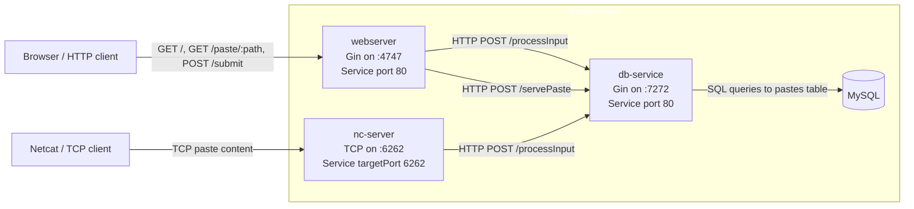

+++
title = "Shellbin Project Writeup"
date = 2026-03-04
slug = "shellbin"
+++

## Introduction

Shellbin is a microservice architecture project that I built to exercise my understanding of CI/CD for cloud-native applications.

It's named shellbin because it's a pastebin clone that you can access with your shell using Unix pipes and the `netcat` utility.

```fish
cat $FILE | nc <shellbin.address>
```

The product is intentionally simple, it's just a pastebin clone. This lets us think about the DevOps aspects of the project without worrying too much about the product implementation.

### Technical Overview
- There are four container images involved in shellbin. Three containers use custom binaries built with go, and one container is stock mysql.

- There are two repos involved in building and deploying shellbin:

1. `england2/shellbin`
    - Contains both application source code **and** templating/build files (Dockerfiles and Helm chart)
    - Builds and pushes the container images via GitHub Actions
    - Defines how the application is deployed onto Kubernetes via Helm
2. `england2/cluster-repo`
    - Is the main GitOps repository for my local cluster; holds cluster related configuration
    - Declares the desired state of the Kubernetes cluster
    - Exposes `shellbin` configuration plainly, allowing for a simpler mutli-repo deployment pipeline
    - Allows us to actually deploy `shellbin` easily

- the deployment pipeline is based on ArgoCD, GitHub Actions, and GHCR.

### Source code!
The good stuff right up front.

Here's the [shellbin source code](https://www.github.com/england2/shellbin), and here's the [cluster-repo source code](https://www.github.com/england2/cluster-repo).

## Project Structure



The project has 4 distinct services:

- `webserver`
  - provides web interface to create and view posts
  - communicates with `db-service` for database operations
- `nc-service`
  - provides netcat server to create pastes from the commandline
  - communicates with `db-service` to access the database
- `db-service`
  - shared layer database layer between `webserver` and `db-server`
  - used by both webserver and nc-server to interact with the database
- `mysql`
    - a stock mysql container representing the database
    - manages data as a simple statefulSet with a persistentVolumeClaim

## How does the CI/CD work?

## ArgoCD

First, lets cover ArgoCD. ArgoCD is a declarative GitOps system for Kubernetes. This means that it uses a git repo as a _"source of truth"_, and reconciles the cluster state to match the yaml/state that's defined in the repo.

Here's a basic example:
- ArgoCD is configured to watch a certain folder named `test-dir` that exists in a git repo.
- In `test-dir`, I define a Kubernetes resource called `test-deployment.yml`.
- I commit and push this change to the git repo.
- ArgoCD detects this change and creates this resource automatically!

And here are some additional details that come into play with this project.
- ArgoCD can be configured to watch a folder in _any repository_, not just the main cluster configuration repo.
- ArgoCD can be configured to watch a folder representing a _full Helm chart_ (and deploy it as such), not just separate yaml files.
- ArgoCD can select a different helm values.yml chart than what is shipped in the default Helm release.

This helps us define the `shellbin` deployment agnosticly. Its deployment is not _tied_ ArgoCD, anyone with Helm can deploy it.

ArgoCD allows for deployment of related Kubernetes resources using what it calls an "Application".
The following a snippet of our ArgoCD Application definition along with relevant comments.

[application-shellbin.yml](https://github.com/england2/cluster-repo/blob/master/argocd-reconciled-yaml/cluster-yaml/applications-argocd-config/application-shellbin.yml)

```yaml
# ...
  sources:
    # Select the `shellbin` repo as a source.
    - repoURL: git@github.com:england2/shellbin.git
      # Deploy from the default branch (main).
      targetRevision: HEAD
      # `path: helm` refers to the `helm` folder in england2/shellbin, which is the 
      # folder where our shellbin Helm chart lives
      path: helm
      # Configuring this ArgoCD Application to template and deploy a Helm chart.
      helm:
        releaseName: shellbin
        valueFiles:
          # Here we tell ArgoCD to ignore the default Helm values, and use one defined in the
          # `cluster-repo` repository (the same repo that this file exists in).
          - $cluster-repo/argocd-reconciled-yaml/applications/shellbin/helm-values-shellbin.yml
      # Here we enable the $cluster-repo reference that's used above, allowing us to refer to 
      # files in `cluster-repo` rather than `shellbin`.
    - repoURL: git@github.com:england2/cluster-repo.git
      targetRevision: HEAD
      ref: cluster-repo
```

To review:
- ArgoCD watches the `helm/` directory in the shellbin repository for any changes
- When ArgoCD finds a difference between the current shellbin deployment and what is defined in the `shellbin` repo, it updates the cluster.
- We define a seperate values.yml than what shellbin ships with 
  - specifically, we use `cluster-repo/.../helm-values-shellbin.yml`

## The actual pipeline

We've established that our cluster is watching shellbin's Helm chart within it's repo, which means that any changes to deployment manifests (i.e yaml configuration) will be reconciled to our cluster.

However, Helm is only acting as a yaml templating engine [^1]. It helps us define and deploy yaml, but it has no knowledge of our container images aside from a string that provides a url to fetch a certain image.

Therefore, despite using Helm   we our shellbin still need to: 
1. build and push our container images
2. tell our cluster to use the new images

[^1]: Additionally, ArgoCD also doesn't even deploy a Helm Chart. It uses the Helm Templating engine to render and deploy yaml, and then manages the resulting resources itself. Therefore, `$ helm [list|show|uninstall|etc]` are all inert because Helm is not managing anything.

### Build and push our container images
Building and pushing pure-go images is super simple, especially when using GHCR.

The full [pipeline.yml](https://github.com/england2/shellbin/blob/master/.github/workflows/pipeline.yml) is very easy to read, so I can reccommend just checking that out.

Moving on, here's some deciding info how we'll design our pipeline:
1. The build and deployment pipeline of `shellbin` must ultimately rely on two seperate repos.
2. The exact state of our Go binaries is determined by our shellbin repo.
3. Therefore, we should tag new images using the SHA of the commit that built them.

This way, we can always see what code is actually running in a binary by checking out that commit in the main branch of shellbin. While ArgoCD can determine if our cluster's manifests are desynchronized, it certainly can't do the same for a binary. This solution lets us confirm exactly what exactly is deployed.

### Example

Here's a snippet of shellbin's pipeline.yml that shows the step that builds, tags, and pushes our images to the registry.

```yaml
# (shellbin) pipeline.yml snippet
# ... 
      - name: Build and push
        uses: docker/build-push-action@v6
        with:
          # All container build configuration is defined in a matrix, allowing for parallel builds
          # and code reuse.
          context: ${{ matrix.container_dir }}
          file: ${{ matrix.container_dir }}/Dockerfile
          push: true
          tags: |
            
           # Here is where we tag the image with the current git commit sha.
            ${{ env.IMAGE_REPO }}:${{ matrix.image_tag }}-${{ github.sha }}
           # Update the base image tag; this way that refers to an unspecific image will
           # still get the most recent image we built.
            ${{ env.IMAGE_REPO }}:${{ matrix.image_tag }}
          cache-from: type=gha,scope=${{ matrix.image_tag }}
          cache-to: type=gha,mode=max,scope=${{ matrix.image_tag }}
```


Now let's jump back cluster-repo and look at part of [helm-values-shellbin.yml](https://github.com/england2/cluster-repo/blob/main/argocd-reconciled-yaml/applications/shellbin/helm-values-shellbin.yml). 


```yaml
# (cluster-repo) helm-values-shellbin.yml snippet
# ... 
webserver:
  replicaCount: 1
  name: webserver
  image:
    repository: ghcr.io/england2/shellbin
    pullPolicy: IfNotPresent
    # Here is where we define the specific image we deploy for each microservice.
    tag: webserver-60b47cf062ab5455cd1330ee952dc9c1f07229bd
# And 2 microservice configuration blocks below.
```

1. Because `helm-values-shellbin.yml` is a dependency of the Helm chart whose yaml ArgoCD templated and deployed, whenever `helm-values-shellbin.yml` changes in the HEAD branch, ArgoCD will re-template the full `shellbin` chart and redeploy as necesarry

2. The line `tag: webserver-60b47cf062ab5455cd1330ee952dc9c1f07229bd` is where we tell ArgoCD which image we use.

The next steps of our pipeline are:
1. checkout `cluster-repo`
2. change the image SHAs of the helm values chart
3. commit the changes and push to `cluster-repo`

Here's step 2, where we alter the image SHAs:
```yaml
# (shellbin) pipline.yml snippet
# ...
        with:
          cmd: >-
            yq -i
            '.webserver.image.tag = "webserver-" + strenv(IMAGE_SHA) |
            .dbservice.image.tag = "dbservice-" + strenv(IMAGE_SHA) |
            .ncserver.image.tag = "ncserver-" + strenv(IMAGE_SHA)'
            'cluster-repo/${{ env.VALUES_FILE }}'
```

And then ArgoCD should handle the rest! It deploy the new chart, and Kubernetes will pull and run the most recent container images.

## Demos

Pods are running container image tied to a git-commit

```sh
# What image is our webserver running?
$ kubectl get po -o yaml webserver-c6b9f9495-w9rdh | rg 'image: '
    image: ghcr.io/england2/shellbin:webserver-c4b2d5f3b6afc0c28dab601b001d64a9bea2a3c4
    image: ghcr.io/england2/shellbin:webserver-60b47cf062ab5455cd1330ee952dc9c1f07229bd

# Okay, what commit is that?
 $ git show -s c4b2d5f3b6afc0c28dab601b001d64a9bea2a3c4
commit c4b2d5f3b6afc0c28dab601b001d64a9bea2a3c4 (HEAD -> master, origin/master, origin/HEAD)
Author: te <____@protonmail.com>
Date:   Fri Mar 20 13:46:45 2026 -0700

    chore: renamed workflow
```
