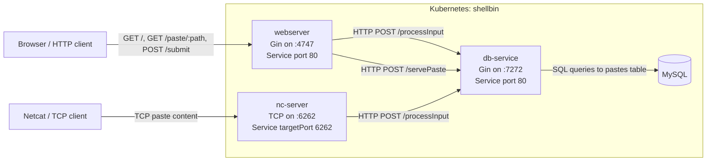

# Elan England

**This website has a few purposes:**
- To host my [resume](/resume/).
- To host various tutorials and articles about miscellaneous software things.
- Show write-ups for larger scale projects I've made. See below for a list of all projects

<br>

## [**Shellbin**](/shellbin/)
---

Shellbin is a microservice architecture project that I built to exercise my understanding of CI/CD for cloud-native applications.

It's named shellbin because it's a pastebin clone that you can access using your shell, without even needing `curl`.

```fish
cat $FILE | nc sb.cat-z.xyz
```

Additionally, there is a GUI web-interface that is exposed by a plain-old webserver written in Golang.

The CLI and the web-interface both talk with the same decoupled microservice to which itself talks to the database, which is expressed in the diagram below.



The diagram below shows that both the CLI and GUI interfaces both talk to the same database-managing microservice. 

I also implemented full end-to-end testing and CI/CD with my local Kubernetes cluster!
Read the [full post here](/shellbin/) for more details.

<br>
    
## [_Web Terminal_](/web-terminal/)
---

This is a larger, abandoned project that I took up because I wanted to do something that at the time sounded really big and scary sounding. Basically, I wanted to write some custom golang code to interact with the Kubernetes API to create, destroy, and scale pods based on user load.

This project was way out of my comfort zone, and the source code reflects that.

However, I learned a lot about Kubernetes in the process, and even had the opportunity to apply a common Golang concurrency pattern
