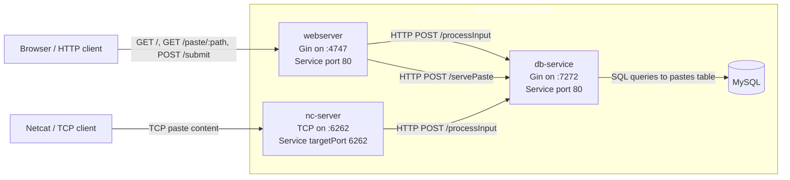

# Elan England

**On this site you can find**
- My [resume](/resume/).
- [All articles](/all-posts/) about various technical topics.
-  Write-ups for larger scale projects I've completed. Scroll below to see introductions, and click on the header to see the full write-up page.

<br>

## [Shellbin](/shellbin/)

Shellbin is a microservice architecture project that I built to exercise my understanding of CI/CD for cloud-native applications.

It's named shellbin because it's a pastebin clone that you can access using your shell, without even needing curl.

```fish
cat $FILE | nc sb.cat-z.xyz
```

Additionally, there is a GUI web-interface that is exposed by a plain-old webserver written in Golang.

The CLI and the web-interface both talk with the same decoupled microservice which itself talks to the database. 
This relationship is expressed in the diagram below.


<!--ai--done -->
  <!-- this part of the graph is hard to read. is there anyway to force a specific class styling on it? I want to give it white text -->
  <!--subgraph K8s["Kubernetes: shellbin"]-->



In total, there are 4 discrete container images involved in this project. A webserver, a database service, a netcat service, and the MysQL database software itself.

The main goal was to implement a full CI/CD developement pipeline for microservice style software. 

This includes building the testing the microservice binary entrypoints (golang unit test).

Read the [full write here](/shellbin/) for more details.

<br>
    
## [Web Terminal](/web-terminal/)
---


This is a larger, abandoned project that I took up because I wanted to do something that at the time sounded really big and scary sounding. Basically, I wanted to write some custom golang code to interact with the Kubernetes API to create, destroy, and scale pods based on user load.

This project was way out of my comfort zone, and the source code reflects that.

However, I learned a lot about Kubernetes in the process, and even had the opportunity to apply a common Golang concurrency pattern


## [Kubernetes Cluster](/cluster/)

My local kubernetes cluster, lovingly named `Hell pit`.


