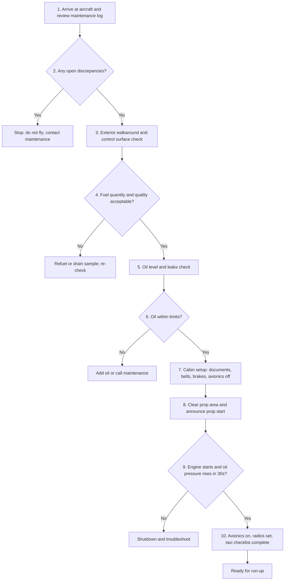

+++
title = "Small Plane Preflight and Start Flowchart"
date = 2026-03-04
categories = ["aviation", "diagram"]
tags = ["mermaid", "flowchart", "checklist"]
+++

This page tests Mermaid rendering with an inspect/start decision flow.

